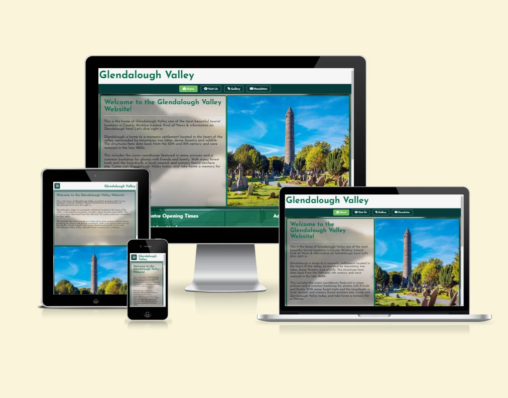
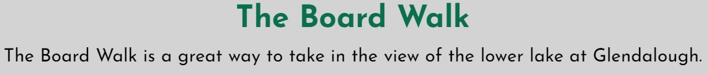
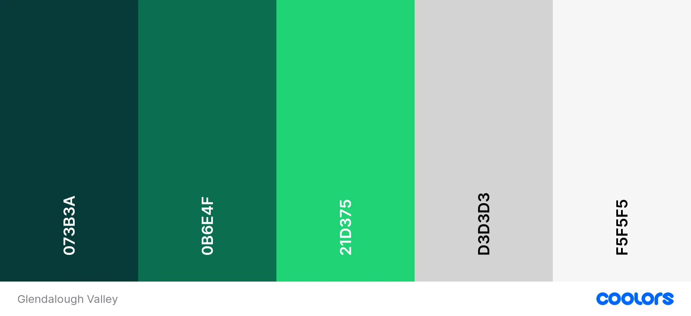
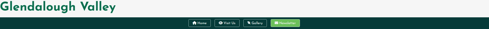
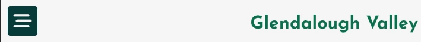
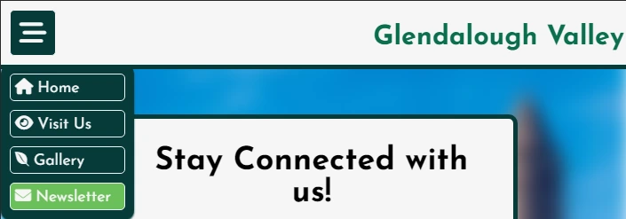

# Glendalough Valley

[Glendalough Valley](https://marcusfdev.github.io/glendalough-project1/index.html) has been designed as a information guide about a very popular tourist destination in Ireland. It's goal is to interest and attract people to come visit, and  to provide tourists of the park with all the nessasry information they may need to plan their day accordingly in a clear, concise and visually appealing design on every device for all users.

The Glendalough Valley site provides relevant information, times and pictures along with ways for users to stay connected and return to the site.

---

# Table of Contents

1. 

---
# UX

## Goals

### Visitor Goals

The target audience for Glendalough Valley are:

- Visitors that want to come to Glendalough National park.
- Visitors that want to learn more about the park.
- Visitors that would like to stay updated on any park developments.
- Visitors who enjoy hiking and excerise.
- Visitors who love nature and the natural enviroment.

The User goals are:

- To figure out what Glendalough is.
- To find valuable information on Glendalough.
- To discover why they would want to visit there.
- To find out what there is to do at the park.
- To keep notified of the ongoings of Glendalough.

The Glendalough Valley site fills these goals by:

- Providing an immediate explaination of Glendalough.
- Providing visitor centre times & admission prices.
- Providing a Google map of Glendalough's location.
- Providing a webpage covering things a visitor can do there.
- Providing beauitful images of the park and wildlife in a gallery.
- Providing social media links for other park outlets.
- Providing a newsletter users can subscribe to for updates.

### Buisness Goals

The Buisness Goals for Glendalough Valley are:

- Gain subscribers to the newsletter.
- Interest visitors to coming to Glendalough.
- Gain more traffic to other site social media outlets.
- Interest visitors in engaging with different activities in the park.

### User Stories

1. As a user looking for new places to explore, I expect the site to excourage me to go there.
2. I expect the website to be clear and not confusing to navigate.
3. As a user I expect to be able to use the website while away from home.
4. If there is any payments or timings I should be aware of, I expect to read about it on the site.
5. I would like to hear about any important updates regarding Glendalough so I can plan ahead.
6. As a user I want to know all the best things I can do there if I go.
7. As a person using the site I expect to know where I can get food nearby.

## Visual Design

### Wireframes

Wireframes:

### Fonts

- The primary font used on the website was [Josefin Sans](https://fonts.google.com/specimen/Josefin+Sans?query=josefin+sans). This font was chosen as the main font because it gives the website a 'Celtic' aesthetic which suits a very old and history rich region in Ireland. Practically, this font is easy to read on all devices and is not as harsh on the eyes to read as other fonts with a similar theme. This font styles well as headings and large sections of text which allowed for a universal use of the font across all text on the site. This was very important as this website is designed to be accessible and attractive to all users of the site. 
- The secondary font for the website [Open Sans](https://fonts.google.com/specimen/Open+Sans?query=open+sans) was chosen because of it's easy readability for large amounts of text. It is both playful and inviting to all users, providing a welcoming and friendly feeling which is reflective of Glendalough itself with it's wonderful nature and beauty.

### Icons

- Icons used throughout the website were taken from the [Font Awesome](https://fontawesome.com/search) icon library. They are utilized in the `<i>` tag.
- Icons are used in the Navigation Bar & Footer as well as other elements across the website such as the 404.html page. They were used to create a more visually appealing site. Appropriate use of icons was done to also visually help users navigate the webpages.

### Colors

- When designing the website, matching and complimenting colors needed to be used to have unified theme that suited the project. Glendalough is part of a National Park, people go there to experience nature. It is also by extension associated with Ireland's beauty. So finding colors that best reflected this was crucial. It was decided that three different shades of green would be the vibrant colors utilized.
- The darkest green on the palette, Midnight Green or #073B3A, was used as borders and to highlight structure as it stands out on the page quite well. 
- The next green that was chosen was Dartmouth Green or #0B6E4F. This Green was utilized as the Title and text headings. It stands out from the Light Gray and White Smoke colors present, but not too 'strong' by comparison to Midnight Green used for the borders. 
- The lightest green, Emerald or #21D375 was used as a highlight color for links/buttons on the webpage. It stands out for it's light and eye catching brightness, but if used too much could be considered too bright. It however keeps to the nature theme of the website and is perfect for highlights to gain the users attention. 
- The website's primary colors were chosen as shades of green so finding a suitable color to match and balance this out was required. The use of Whitesmoke or #F5F5F5 was chosen as a color that has a soft contrast to the greens prevalent on the site. It is not as harsh as standard white and was deemed more suitable. It is used quite often to contrast the greens, sometimes as font coloring. 
- Light Gray or #D3D3D3 was used as a even softer contrast to the greens. It is used as background colors for large amounts of text for ease of reading while also making the vibrant colors around it 'pop' out more to the user. 
- Finally, default Black font color was otherwise used as the main text color. It stands out from the light gray around it, directs attention to itself but not harsh with the contrast around it for the user to read.

---
# Features

## Page Elements

### All Web Pages

### Header & Navigation Bar

- The Header & Navigational bar is located on every page of the website. It was designed to be clear a simple with button links to each webpage.
- The Header itself is a link back to the Home page when clicked.
- Each button hightlights when hovered over with a mouse & the page the user is on is indicated by the constant highlighted button on the Navbar.
- It is responsive to all devices.

- Navigation Bar becomes hidden when viewport shrinks, becomes a dropdown button for users on Phones & Tablets to conserve screen space. 

- The dropdown menu appears below the button when pressed.

### Footer