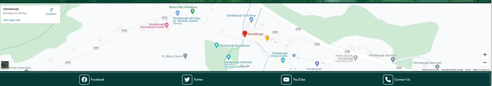
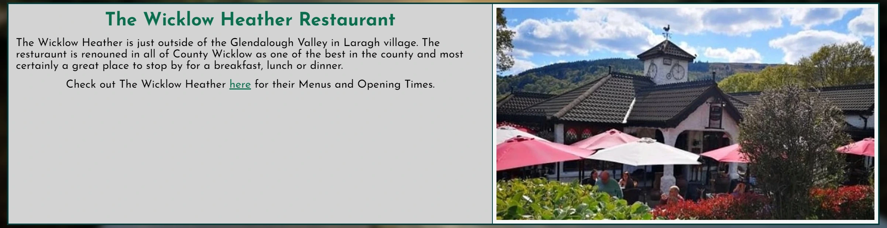
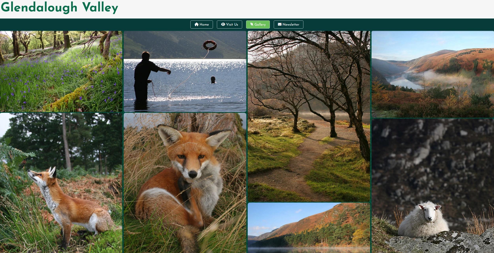
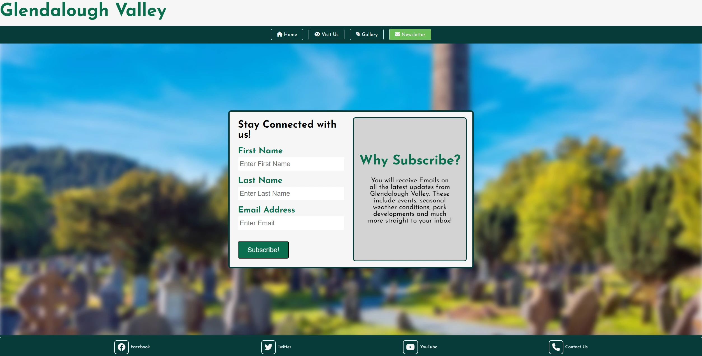
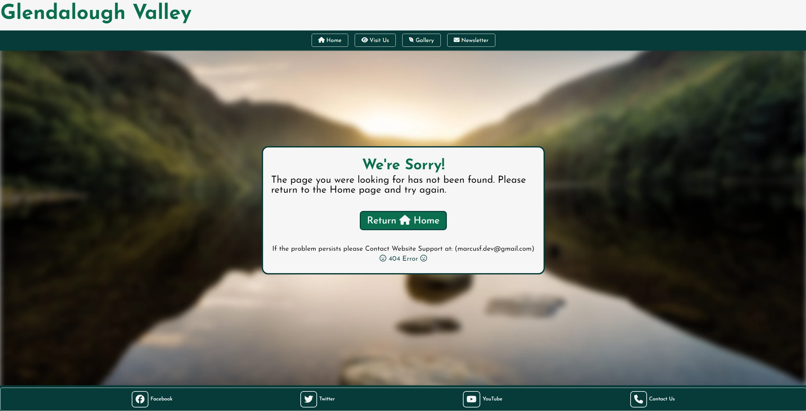
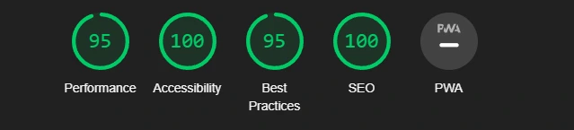

# Glendalough Valley

[Glendalough Valley](https://marcusfdev.github.io/glendalough-project1/index.html) has been designed as a information guide about a very popular tourist destination in Ireland. It's goal is to interest and attract people to come visit, and  to provide tourists of the park with all the nessasry information they may need to plan their day accordingly in a clear, concise and visually appealing design on every device for all users.

The Glendalough Valley site provides relevant information, times and pictures along with ways for users to stay connected and return to the site.

---

# Table of Contents

1. [UX](#ux)
   - [Goals](#goals)
     - [Visitor Goals](#visitor-goals)
     - [Business](#buisness-goals)
     - [User Stories](#user-stories)
   - [Visual Design](#visual-design)
     - [Wireframes](#wireframes)
     - [Fonts](#fonts)
     - [Icons](#icons)
     - [Colors](#colors)
     - [Gallery Background](#gallery-background)

2. [Features](#features)
   - [Page Elements](#page-elements)
     - [All Web Pages](#all-web-pages)
     - [Header & Navigational Bar](#header--navigation-bar)
     - [Footer](#footer)
     - [Index Page](#index-page)
     - [Visit Us Page](#visit-us-page)
     - [Gallery Page](#gallery-page)
     - [Newsletter Page](#newsletter-page)
   - [Additional Site Features](#additional-site-features)
     - [404 Error Page](#404-error-page)
   - [Feature Ideas](#feature-ideas)
     - [Site Content](#site-content)
     - [Site Design](#site-design)

3. [Technology Used](#technology-used)
   - [Languages](#languages)
   - [Libraries](#libraries)
   - [Platforms](#platforms)
   - [Other Tools](#other-tools)

4. [Testing](#testing)
   - [Methods](#methods)
     - [Validation](#validation)
     - [General Testing](#general-testing)
   - [Bugs](#bugs)
     - [Known Bugs](#known-bugs)
     - [Fixed Bugs](#fixed-bugs)

5. [Deployment](#deployment)
   - [Github Deployment](#github-deployment)
     - [Github Preparation](#github-preparation)
     - [Github Instructions](#github-instructions)

6. [Credits and Contact](#credits-and-contact)
   - [Credits](#credits)
   - [Contact](#contact)

---

# UX

## Goals

### Visitor Goals

The target audience for Glendalough Valley are:

- Visitors that want to come to Glendalough National park.
- Visitors that want to learn more about the park.
- Visitors that would like to stay updated on any park developments.
- Visitors who enjoy hiking and excerise.
- Visitors who love nature and the natural enviroment.

The User goals are:

- To figure out what Glendalough is.
- To find valuable information on Glendalough.
- To discover why they would want to visit there.
- To find out what there is to do at the park.
- To keep notified of the ongoings of Glendalough.

The Glendalough Valley site fills these goals by:

- Providing an immediate explaination of Glendalough.
- Providing visitor centre times & admission prices.
- Providing a Google map of Glendalough's location.
- Providing a webpage covering things a visitor can do there.
- Providing beauitful images of the park and wildlife in a gallery.
- Providing social media links for other park outlets.
- Providing a newsletter users can subscribe to for updates.

### Buisness Goals

The Buisness Goals for Glendalough Valley are:

- Gain subscribers to the newsletter.
- Interest visitors to coming to Glendalough.
- Gain more traffic to other site social media outlets.
- Interest visitors in engaging with different activities in the park.

### User Stories

1. As a user looking for new places to explore, I expect the site to excourage me to go there.
2. I expect the website to be clear and not confusing to navigate.
3. As a user I expect to be able to use the website while away from home.
4. If there is any payments or timings I should be aware of, I expect to read about it on the site.
5. I would like to hear about any important updates regarding Glendalough so I can plan ahead.
6. As a user I want to know all the best things I can do there if I go.
7. As a person using the site I expect to know where I can get food nearby.

## Visual Design

### Wireframes

Wireframes:

### Fonts

- The primary font used on the website was [Josefin Sans](https://fonts.google.com/specimen/Josefin+Sans?query=josefin+sans). This font was chosen as the main font because it gives the website a 'Celtic' aesthetic which suits a very old and history rich region in Ireland. Practically, this font is easy to read on all devices and is not as harsh on the eyes to read as other fonts with a similar theme. This font styles well as headings and large sections of text which allowed for a universal use of the font across all text on the site. This was very important as this website is designed to be accessible and attractive to all users of the site. 
- The secondary font for the website [Open Sans](https://fonts.google.com/specimen/Open+Sans?query=open+sans) was chosen because of it's easy readability for large amounts of text. It is both playful and inviting to all users, providing a welcoming and friendly feeling which is reflective of Glendalough itself with it's wonderful nature and beauty.

### Icons

- Icons used throughout the website were taken from the [Font Awesome](https://fontawesome.com/search) icon library. They are utilized in the `<i>` tag.
- Icons are used in the Navigation Bar & Footer as well as other elements across the website such as the 404.html page. They were used to create a more visually appealing site. Appropriate use of icons was done to also visually help users navigate the webpages.

### Colors

- When designing the website, matching and complimenting colors needed to be used to have unified theme that suited the project. Glendalough is part of a National Park, people go there to experience nature. It is also by extension associated with Ireland's beauty. So finding colors that best reflected this was crucial. It was decided that three different shades of green would be the vibrant colors utilized.
- The darkest green on the palette, Midnight Green or #073B3A, was used as borders and to highlight structure as it stands out on the page quite well. 
- The next green that was chosen was Dartmouth Green or #0B6E4F. This Green was utilized as the Title and text headings. It stands out from the Light Gray and White Smoke colors present, but not too 'strong' by comparison to Midnight Green used for the borders. 
- The lightest green, Emerald or #21D375 was used as a highlight color for links/buttons on the webpage. It stands out for it's light and eye catching brightness, but if used too much could be considered too bright. It however keeps to the nature theme of the website and is perfect for highlights to gain the users attention. 
- The website's primary colors were chosen as shades of green so finding a suitable color to match and balance this out was required. The use of Whitesmoke or #F5F5F5 was chosen as a color that has a soft contrast to the greens prevalent on the site. It is not as harsh as standard white and was deemed more suitable. It is used quite often to contrast the greens, sometimes as font coloring. 
- Light Gray or #D3D3D3 was used as a even softer contrast to the greens. It is used as background colors for large amounts of text for ease of reading while also making the vibrant colors around it 'pop' out more to the user. 
- Finally, default Black font color was otherwise used as the main text color. It stands out from the light gray around it, directs attention to itself but not harsh with the contrast around it for the user to read.

### Gallery background

- When creating the Gallery page, having a background that provided color but also texture was the goal. During the Gallery's creation, testing using images as graphics to enhance the standard color palette was being worked on. Soon later it was decided that avoiding attempting to achieve this across the entire website for this project due to conscious time constraints was best. However using it here was still possible. 
- Finding the image online, it was edited using Windows photo tools until the coloring matched the style that was needed.
- Using `<background-repeat:repeat;>` on the image it created a repeating style across the back of the page which filled the spacing between the gallery images well. 
---
# Features

## Page Elements

### All Web Pages

### Header & Navigation Bar

- The Header & Navigational bar is located on every page of the website. It was designed to be clear a simple with button links to each webpage.
- The Header itself is a link back to the Home page when clicked.
- Each button hightlights when hovered over with a mouse & the page the user is on is indicated by the constant highlighted button on the Navbar.
- It is responsive to the device viewport.

 

- Navigation Bar becomes hidden when viewport shrinks, becomes a dropdown button for users on Phones & Tablets to conserve screen space.
- The dropdown menu appears below the button when pressed.

### Footer

- The Footer is located on every page of the website. It is designed to match the Header & Navigation Bar. It's purpose is to provide the user with Social media links to other site outlets.
- Each link in the footer opens up in a different tab for better user experience.
- The Footer was styled with inspiration from the ["Love Running"](https://learn.codeinstitute.net/courses/course-v1:CodeInstitute+LRFX101+2023_Q2/courseware/e805068059af42af87681032aa64053f/7525117e5cd144daa2a7b0c57843bbee/) project by Code Institute. The code was then customized for the Glendalough Valley website, adding buttons and a highlight feature.
- When hovering over a button with a mouse in the Footer, it highlights the icon. This is done for aesthetic purposes giving the user more interaction on the site.

- The Footer is responsive to viewports. If on a Phone & Tablet device, the text of the link is removed providing more room to the icon buttons and conserving more screen space.

### Index Page

- First section containing two `
` with website introduction providing explaination of site and historical information and picture of Glendalough.
- The `
` containing the Image of Glendalough is removed on small screen devices.
- Second section provides information on visit centre times & admission fees. Has a image placed in the background of visitor centre.
- Page background image of Glendalough lake fixed and blurred for styling.
- This page is responsive to viewport and is readable and accessible to all devices.

- A Google Maps at the bottom of the page implemented using a `<iframe>` element to provide directions to Glendalough. 

### Visit Us Page

- Page contains 7 `<section>` elements providing both a picture a description of things visitors can do at Glendalough.
- Images and description alternate placement using `<flex-direction: row-reverse;>`. 
- Visit Us page is responsive to viewport and is readable and accessible to all devices.

- Final section contains a description of local restaurant and a link to their website utilizing an `<a>` element.

### Gallery Page

- Purpose is to provide users with an image showcase of sites to see at Glendalough.
- Code inspired and edited from Code Institute's ["Love Running"](https://learn.codeinstitute.net/courses/course-v1:CodeInstitute+LRFX101+2023_Q2/courseware/e805068059af42af87681032aa64053f/391954f5ae8547e180a539c0d51e063c/).
- Background image used as pattern and set to `<background-repeat: repeat;>` providing more design to the page.
- Page responds to viewport size and adjusts `<column-count>` accordingly. 
- Pictures sourced from the [Glendalough.ie](https://glendalough.ie/gallery/) Official Website by authors John Griffin Photography & Michael Delahunty.

### Newsletter Page

- Purpose is to provide site users a way to stay connected with the site and Glendalough. Users can subscribe to a newletter they will receive into their inbox of the email they subscribed with.
- Newsletter requires users to fill in all details for a successful submission.
- Can detect if a user typed a invalid email address.
- Newsletter is responsive to viewport and is readable and accessible to all devices.

## Additional Site Features

### 404 Error Page

- Customized 404 error page for website if a page the user is attempting to find is not located. 
- Used 404.html file and styled to match the rest of the website.
- Provided a brief explaination to the user and provided a Return Home button so that the user may return to the Home page.
- Return button highlights if a mouse hovers over it.
- Added a contact support email if problem persists for the user.
- 404 Error page is responsive to viewport and is readable and accessible to all devices.

## Feature Ideas

### Site Content

- Add a Contact Support form to replace email used in 404.html page.
- Add a Transport page for users to plan travelling to Glendalough with more clarity.
- Source more Pictures to be added to the Gallery.

### Site Design

- Change Home page Introduction section and include animations.
- Change Visit Us section to include animations that match Home page.
- Redesign Gallery page implementing a Header and the ability for the user to click on pictures, making them pop out with a title and a description of what they are with fun facts about it.
- Implement more site graphics to compliment the color scheme, texturing and patterns etc.

# Technology Used

## Languages

- [HTML](https://github.com/MarcusFDev/glendalough-project1/blob/main/index.html)
    - Page markup.
- [CSS](https://github.com/MarcusFDev/glendalough-project1/blob/main/assets/css/style.css)
    - Page styling.

## Libraries

- [Google Fonts](https://fonts.google.com)
    - Font Styles.
- [Font Awesome](https://fontawesome.com/search)
    - Used for site icons.

## Platforms

- [Github](https://github.com/MarcusFDev/glendalough-project1?tab=readme-ov-file)
    - Storing code remotely and project deployment.
- [Gitpod](https://www.gitpod.io)
    - IDE for project creation and development.
- [Replit](https://replit.com)
    - Used to test and develop CSS styling in the beginning of the project's creation due to the webview on Gitpod updating far too slowly. Caused unexpected large commits in the beginning, found better solution within Gitpod afterwards.

## Other Tools

- [Favicon Generator](https://www.favicon-generator.org)
    - Tool used to create Website Favicon.
- [Coolers](https://coolors.co)
    - Tool used to create palette image.
- [Am I Responsive?](https://ui.dev/amiresponsive)
    - Tool used to create multiple device image.
- [FreeConvert](https://www.freeconvert.com)
    - Tool used to change all images to .webp file types.

# Testing

## Methods

### Validation

- HTML pages all have been validated with the [W3C HTML5 Validator](https://validator.w3.org/nu/#textarea) tool.
- All CSS code has been validated with the [W3C CSS Validator](https://jigsaw.w3.org/css-validator/validator) tool.
- Accessibility has been tested using developer tools utilizing lighthouse.

### General Testing

- After every change that was made, everything was prompty tested to check for change.
- Newsletter form will not submit without correct information.
- All External links work and open in seperate tabs.
- All internal links work and send to their respective pages.
- Custom 404 Error page works correctly.
- Any backup features added were tested and work as intended. 
- The website appears to function correctly in different browsers: Chrome, OperaGX, Microsoft Edge.
- Using Chrome Developer tools, site responsiveness was tested for all major device sizes including the Galaxy Fold.

## Bugs

### Known Bugs

- Google Map has issue with loading API directly resulting in occasional suboptimal performance from the map.
- Home Page description text begins to go out of box under a very specific viewport width range.
- Gallery page background image does not cover all the screen under a very specific viewport width range.
- Newsletter page Navigation drop down menu appears slightly too high at viewports widths of 320px or less.

### Fixed Bugs

- Resolved an issue where the background image would blur the whole content in the `<main>` element. Placed image in `` instead and classed it accordingly.
- Resolved an issue that caused the images for the Visit Us page to distort the `
` sizes. Changed all images on that page to smaller and unified width ratio.
- Resolved an issue where accessibility for the map was inproper code. Gave the Google Map section a `<h2>` title element. 
- Resolved the following issue that caused the google map title to appear on the site. Gave it a `<display:none;>` class.
- Resolved an issue causing the 404 error page message to not sit center of the screen using margin-left. Changed the property to margin and added auto.

# Deployment

## Github Deployment

### Github Preparation

Requirements:

- You need a GitHub account.

### Github Instructions

1. Log into your Github account and naviagte to this link to the project repository: https://github.com/MarcusFDev/glendalough-project1.
2. You can choose to create your own repository and copy or clone the project code.
3. Go to the Settings page of the repository.
4. Under the Code and automation section scroll down and click on Pages.
5. Select the Master Branch as the source and Confirm the selection.
6. Wait a few minutes and the site should be live for viewing. See my own [right here.](https://marcusfdev.github.io/glendalough-project1/index.html)

## Credits and Contact

### Credits

Images were sourced by various sources throughout the project so here is a list:

- [Gallery Images](https://glendalough.ie/gallery/) by John Griffin Photography & Michael Delahunty.
- [Home, Visit Us & 404 page background](https://www.bryanhanna.com/shop/glendalough/) by Bryan Hanna.
- [Boardwalk image](https://commons.m.wikimedia.org/wiki/File:Boardwalk_above_the_Lower_Lake,_Glendalough_-_geograph.org.uk_-_4579298.jpg) by Jonathan Thacker.
- [Spincs Mountain & Miner's Village](https://www.theirishroadtrip.com/the-spinc-glendalough/) by The Irish Road Trip.
- [Upperlake Swim](https://www.thetimes.co.uk/article/the-best-25-spots-in-ireland-for-a-swim-9ctdstsnm) by The Times.
- [Picnic Tables](https://www.lazydays.ie/visit-glendalough/) by Lazy Days.
- [Wicklow Heather](https://www.opentable.com/r/the-wicklow-heather-glendalough-2) by Open Table.
- [Newsletter page background](https://connemaramarble.com/inspirational-glendalough/glendalough-image/) by Connermara Marble.

Code that was taken and edited accordingly:

- Original Footer & Gallery code by [Code Institute](https://codeinstitute.net/ie/).

### Contact

Please feel free to reach out if you have any questions. Contact me via my email at marcusf.dev@gmail.com